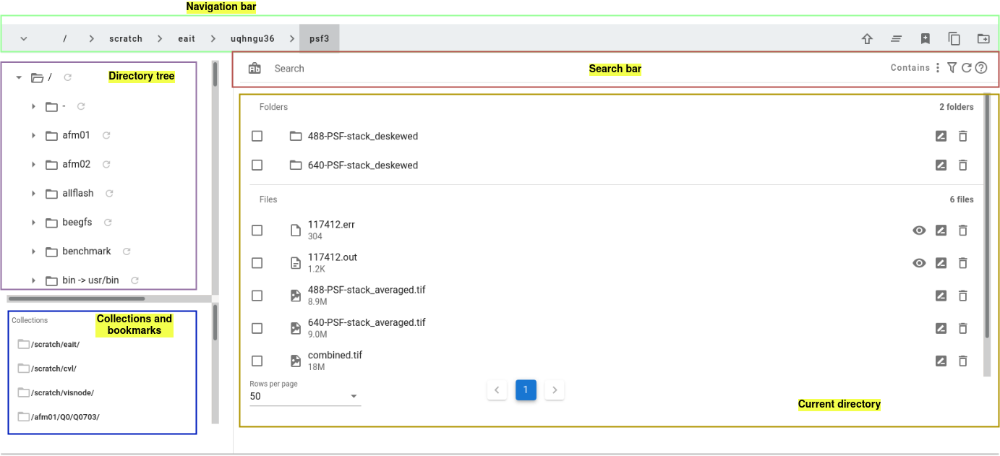

# User Guide

## Files Manager

Files Manager consists of 5 sub components:
<ul>
    <li><b>Navigation bar</b> for navigating up and down in the directory tree</li>
    <li><b>Directory tree</b> for showing where you are in the directory tree</li>
    <li><b>Collections and bookmarks</b> for quick access to your collections and bookmarks</li>
    <li><b>Search bar</b> for filtering files/folders in the current path</li>
    <li><b>Current directory</b> for showing files/folders in the current path</li>
</ul>
### Search bar
You can use this for filtering files/folders of interests. 
* You can toggle case sensitivity with the button on the left
* You can change different modes of filtering, including
** Contains: any folder/file name contains the search text
** StartsWith: any folder/file name starts with the search text
** EndsWith: any folder/file that ends with the search text 
** Custom: any glob filter

## Converter

## Preprocessing

## Deconvolution

## Jobs Management